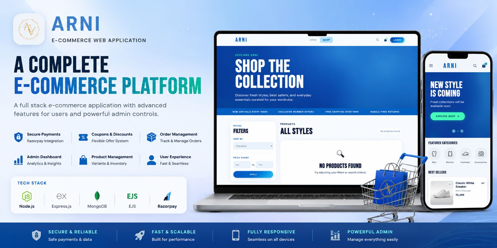

# Arni — My First End-to-End E-Commerce Project

> A server-rendered commerce application built to understand how customer and administrative workflows fit together across a complete purchase lifecycle.

[](https://arni.arjunpj.online)
[](https://github.com/arjunpj-11/Arni)

Arni was my first major full-stack project. I built it while learning MERN-stack development at Brototype to connect the concepts I had studied separately—browser interactions, server-side application logic, database modelling, authentication, payments, inventory, and operational workflows—inside one working e-commerce application.

Arni is a completed learning project, not a commercial product or client engagement. Its purpose was to establish my full-stack development foundation by building a substantial application from end to end.

## What the Project Covers

### Customer experience

- Account registration with email OTP verification, login, logout, password recovery, and Google/Facebook sign-in
- Product discovery through categories, subcategories, search, product details, colour variants, and size-level availability
- Cart and wishlist management with quantity and stock validation
- Saved addresses, primary-address selection, coupon application, and checkout
- Cash on delivery, wallet payment, and Razorpay order creation and signature verification
- Order history and detail views, cancellation requests, return/refund requests, and wallet transaction history

### Administration

- Separate session-protected administrator routes
- Dashboard summaries for sales, revenue, users, products, and orders
- Product, image, colour-variant, size-stock, category, and subcategory management
- Coupon, banner, user, and order management
- Controlled order-status transitions, inventory reconciliation, and wallet refunds
- Date-filtered sales reporting with CSV and PDF exports

## Key Technical Work

### Authentication and authorization

Express sessions are stored in MongoDB when a database connection is configured. Customer and administrator middleware protect their respective routes, while blocked-account checks apply across authenticated customer journeys. Registration and password recovery use time-limited email OTPs with attempt limits; Passport provides Google and Facebook sign-in.

### Products and inventory

Mongoose models represent products, categories, subcategories, and colour variants. Each variant holds size-level stock, pricing, and Cloudinary-hosted image URLs. Cart and checkout operations validate requested quantities against the selected variant and size.

### Cart, checkout, and order lifecycle

The cart identifies an item by variant and size, recalculates totals, invalidates stale coupons when contents change, and blocks invalid or over-stock quantities. Checkout supports saved addresses and creates per-item orders inside MongoDB transactions where the deployment supports them. Order transitions cover pending, processing, shipped, delivered, cancelled, refund-requested, returned, and payment-failure states.

### Payments, wallet, coupons, and returns

- Razorpay orders are created on the server and successful callbacks are verified with an HMAC signature before paid orders are persisted.
- Wallet payments debit the stored balance and record a transaction.
- Coupon eligibility, expiry, minimum order value, and prior usage are checked before applying a discount.
- Paid cancellations and approved refunds credit the customer's wallet and restore inventory where appropriate.
- Administrators can approve or reject refund requests.

### Reliability and security work

The Express application uses Helmet, compression, request-size limits, rate limiting on authentication/API routes, secure session-cookie settings in production, and centralized error handling. Automated checks compile server/browser JavaScript and EJS templates; the integration suite exercises public routes, authentication, cart, address, wallet, checkout, cancellation, refund, inventory, admin authorization, and reporting behaviour against QA fixtures.

## Architecture

Arni follows an MVC-style, feature-grouped Express structure:

```text
Arni/
├── bin/              # HTTP server entry point
├── config/           # External service configuration
├── controllers/      # Customer, admin, authentication, and storefront logic
├── middlewares/      # Authentication, block-status, and error handling
├── models/           # Mongoose schemas for commerce data
├── public/           # Browser JavaScript, styles, images, and social metadata asset
├── routes/           # Feature-grouped Express routers
├── scripts/          # Static verification and QA fixture tooling
├── test/             # Node/Supertest integration coverage
├── utilities/        # OTP, email, and identifier helpers
├── views/            # Server-rendered EJS pages and partials
├── app.js            # Express application composition
└── seed.js           # Development/QA data seeding
```

A typical request moves through an Express route and authentication middleware to a feature controller, which applies workflow rules through Mongoose models and then returns either an EJS page or JSON for browser-side interactions.

## Technology Stack

| Area | Technology |
| --- | --- |
| Runtime and server | Node.js, Express.js |
| User interface | EJS, JavaScript, CSS |
| Database and sessions | MongoDB, Mongoose, connect-mongo |
| Authentication | bcryptjs, Express sessions, Passport, email OTP |
| Payments | Razorpay, wallet, cash on delivery |
| Media | Cloudinary |
| Reporting | json2csv, PDFKit |
| Validation and security | Helmet, express-rate-limit |
| Verification | Node test runner, Supertest, EJS compilation checks |

## Local Setup

### Prerequisites

- A current Node.js LTS release
- npm
- MongoDB (local or Atlas)
- Razorpay test credentials for the online-payment flow
- Cloudinary and email credentials for media upload and OTP delivery

### Installation

```bash
git clone https://github.com/arjunpj-11/Arni.git
cd Arni
npm install
```

Create a `.env` file in the repository root:

```env
MongoDB_url=mongodb_connection_string
SESSION_SECRET=session_secret
PORT=3000

RAZORPAY_KEY_ID=razorpay_test_key_id
RAZORPAY_KEY_SECRET=razorpay_test_key_secret

CLOUDINARY_CLOUD_NAME=cloudinary_cloud_name
CLOUDINARY_API_KEY=cloudinary_api_key
CLOUDINARY_API_SECRET=cloudinary_api_secret

EMAIL_USER=otp_sender_email
EMAIL_PASS=otp_sender_app_password

GOOGLE_CLIENT_ID=google_client_id
GOOGLE_CLIENT_SECRET=google_client_secret
GOOGLE_CALLBACK_URL=http://localhost:3000/api/google/auth/google/callback

FACEBOOK_APP_ID=facebook_app_id
FACEBOOK_APP_SECRET=facebook_app_secret
FACEBOOK_CALLBACK_URL=http://localhost:3000/api/facebook/auth/facebook/callback
```

The application also accepts `MONGO_URI` as the database variable. OAuth variables are only required when testing those providers.

Start the server:

```bash
npm start
```

Then open [http://localhost:3000](http://localhost:3000).

## Verification

Run the dependency-free source and template checks:

```bash
npm test
```

The database-backed integration suite requires QA data in a non-production database:

```bash
npm run test:fixtures
npm run test:integration
```

`test:fixtures` replaces matching QA records, so use it only with a disposable development or test database.

## What I Learned

Arni taught me how a full-stack application behaves as a system rather than as a set of isolated screens. I learned to model connected commerce data, separate routes and controllers, maintain session-based access rules, coordinate inventory with order state, verify payments, handle refunds, render data-driven pages, and debug multi-step workflows that cross the browser, server, and database.

Most importantly, it gave me the practical foundation to approach later projects with stronger ideas about modularity, validation, testing, security, and production delivery—without rewriting Arni's history as professional employment or a commercial product.

## Links

- **Live:** [arni.arjunpj.online](https://arni.arjunpj.online)
- **GitHub:** [github.com/arjunpj-11/Arni](https://github.com/arjunpj-11/Arni)

## Repository Metadata

- **GitHub tagline:** From first full-stack build to complete commerce workflow.
- **Repository description:** My first end-to-end full-stack learning project: an Express, EJS, and MongoDB e-commerce app with customer/admin workflows, Razorpay, inventory, wallets, coupons, orders, returns, and reporting.
- **Suggested topics:** `nodejs`, `express`, `mongodb`, `mongoose`, `ejs`, `javascript`, `razorpay`, `ecommerce`, `full-stack`, `mern-learning-project`, `portfolio-project`
